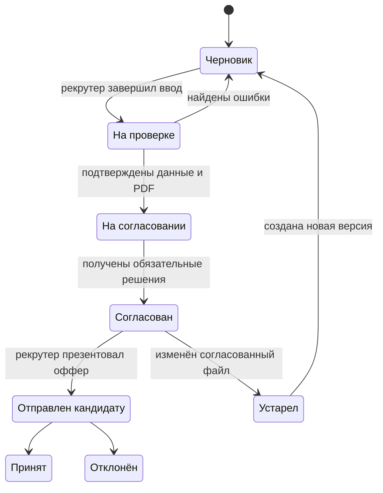

# Ivideon HR Hub

## Финальная схема работы и целевая архитектура

**Версия:** 1.0  
**Дата:** 4 августа 2026 года  
**Статус:** готово к архитектурному апруву  
**Связанный документ:** `Ivideon_HR_Hub_Final_Concept_for_Approval_v1_1.md`

---

## 1. Архитектурное решение в одном абзаце

Ivideon HR Hub строится как защищённое веб-приложение и единая база знаний поверх Huntflow. Портал не копирует вакансии, кандидатов и воронку, а по защищённому API получает только данные, необходимые для конкретного действия, помогает подготовить результат и после подтверждения возвращает его в оригинальную карточку Huntflow. AI-функции проходят через единый AI Gateway, который проверяет данные, выбирает разрешённую модель, фиксирует версию промпта и валидирует ответ. В MVP используются готовые корпоративно разрешённые модели; собственный Model Server, GPU-кластер, Data Lake и Feature Store подключаются только при доказанной необходимости.

## 2. Что должна обеспечить архитектура

- отсутствие второй базы вакансий и кандидатов;
- постоянное безопасное соединение с Huntflow;
- единый интерфейс для автоматизаций и базы знаний;
- отдельные режимы для рекрутера, Руководителя подбора/HRD и заказчика;
- управляемую генерацию офферов, писем и анализа интервью;
- обязательную проверку человеком перед значимым действием;
- трассируемость: кто, когда, из каких данных и какой версией AI создал результат;
- возможность безопасного повторения операций после сбоя;
- масштабирование от Ivideon к модульному HRM;
- соответствие требованиям к персональным данным, доступам и аудиту.

## 3. Главная схема

```mermaid
flowchart TB
    subgraph USERS["Пользователи"]
        REC["Рекрутер"]
        LEAD["Руководитель подбора / HRD"]
        CUSTOMER["Заказчик по защищённой ссылке"]
    end

    subgraph FRONT["1. Frontend и API для интерфейса"]
        WEB["Корпоративный веб-интерфейс"]
        GUEST["Изолированная форма заявки"]
        BFF["Frontend API / BFF"]
        EDGE["WAF, rate limit, проверка сессии"]
    end

    subgraph APP["2. Backend и сервисы приложения"]
        WORK["Фокусы недели, маршруты и заявки"]
        OFFER["Офферы, версии, PDF и согласование"]
        INTERVIEW["Анализ интервью"]
        KNOWLEDGE["База знаний, поиск и подсказки"]
        SOURCING["AI-помощник по поиску"]
        RADAR["HR-радар"]
        ADMIN["Управление, политики и аудит"]
        ORCH["Оркестратор задач и очередь"]
    end

    subgraph AI["3. AI / ML API"]
        AIGW["AI Gateway: политика, обезличивание, маршрутизация"]
        REGISTRY["Версии промптов, моделей и тестов качества"]
        SERVING["Разрешённый внешний AI или собственный Model Server"]
    end

    subgraph DATA["4. Данные и хранилища"]
        PG["PostgreSQL: настройки, заявки, артефакты и аудит"]
        OBJ["Объектное хранилище: PDF и временные файлы"]
        REDIS["Redis / очередь / блокировки"]
        SEARCH["Поисковый индекс базы знаний"]
        DWH["DWH с обезличенной аналитикой — позднее"]
    end

    subgraph EXT["5. Внешние системы — источники истины"]
        HF["Huntflow: вакансии, кандидаты и воронка"]
        MAIL["Gmail / Яндекс Почта"]
        IDP["Корпоративный SSO / Identity Provider"]
        PPLX["Perplexity, RSS и разрешённые источники"]
    end

    subgraph PLATFORM["6. Исполнение, безопасность и эксплуатация"]
        RUNTIME["Контейнеры, среды dev / stage / prod, автоскейлинг"]
        SECURITY["IAM, шифрование, секреты, DLP, антивирус"]
        OBS["Логи, метрики, трассировка, алерты и инциденты"]
        CICD["CI/CD, тесты, миграции и безопасный откат"]
    end

    REC --> WEB
    LEAD --> WEB
    CUSTOMER --> GUEST
    WEB --> EDGE --> BFF
    GUEST --> EDGE
    BFF --> WORK
    BFF --> OFFER
    BFF --> INTERVIEW
    BFF --> KNOWLEDGE
    BFF --> SOURCING
    BFF --> RADAR
    BFF --> ADMIN
    WORK --> ORCH
    OFFER --> ORCH
    INTERVIEW --> ORCH
    SOURCING --> AIGW
    RADAR --> ORCH
    ORCH --> AIGW
    AIGW --> SERVING
    REGISTRY -.->|разрешённые версии| AIGW
    REGISTRY -.->|метрики и история| SERVING
    ORCH <--> HF
    ORCH <--> MAIL
    ORCH <--> PPLX
    EDGE <--> IDP
    WORK <--> PG
    OFFER <--> PG
    INTERVIEW <--> PG
    ADMIN <--> PG
    OFFER <--> OBJ
    INTERVIEW <--> OBJ
    ORCH <--> REDIS
    KNOWLEDGE <--> SEARCH
    PG -.->|обезличенные события| DWH
    SECURITY -.-> EDGE
    SECURITY -.-> BFF
    SECURITY -.-> AIGW
    SECURITY -.-> PG
    OBS -.-> BFF
    OBS -.-> ORCH
    OBS -.-> AIGW
    RUNTIME -.-> BFF
    RUNTIME -.-> ORCH
    CICD -.-> RUNTIME
```

## 4. Как пользователь взаимодействует с системой

### 4.1. Рекрутер

После входа через корпоративный SSO рекрутер видит:

- «Фокусы недели» с датами и назначенными Руководителем подбора поисками;
- офферы на согласовании;
- незавершённые офферы, письма и анализы интервью;
- базу знаний и единый маршрут рекрутера;
- доступные автоматизации.

Рекрутер не видит в портале отдельный список вакансий, кандидатов или копию воронки. Рабочая карточка открывается в Huntflow.

### 4.2. Руководитель подбора и HRD

Они видят:

- новые заявки заказчиков;
- действия «Принять в работу» и «Вернуть на доработку»;
- назначение заявки конкретному рекрутеру;
- фокусы команды на неделю;
- офферы на согласовании;
- шаблоны и правила;
- пользователей и интеграции;
- аудит и операции, требующие ручного вмешательства.

Отдельной роли администратора нет. Все права управления имеют Руководитель подбора и HRD.

### 4.3. Заказчик

Заказчик получает защищённую ссылку и видит только:

- форму своей заявки;
- сохранение черновика;
- комментарий при возврате;
- статус: «Отправлена», «Возвращена на доработку», «Принята в работу» или «Назначена в подбор».

Заказчик не получает доступ к внутренней навигации, кандидатам, другим заявкам или настройкам.

### 4.4. Участники без кабинета

HRBP, Генеральный директор и сотрудники КДП могут участвовать в согласованиях через утверждённые корпоративные каналы, но отдельные роли и кабинеты в первом контуре им не создаются. Факт решения связывается с конкретной версией оффера и фиксируется в аудите.

## 5. Уровень 1. Frontend и Frontend API

### 5.1. Корпоративный интерфейс

Рекомендуемый подход: Next.js / React + TypeScript и единая дизайн-система.

Отвечает за:

- ролевую главную;
- маршрут из 10 этапов;
- базу знаний;
- формы оффера и анализа интервью;
- предпросмотр PDF и письма;
- рабочие статусы операций;
- подсказки `?`;
- адаптивную работу на телефоне и компьютере;
- доступность основных сценариев.

### 5.2. Изолированный интерфейс заказчика

- отдельная оболочка без внутреннего меню;
- доступ только по ограниченному токену;
- возможность продолжить черновик;
- мобильная форма;
- защита от перебора и автоматических отправок;
- никакого API для просмотра списка чужих заявок.

### 5.3. Frontend API / BFF

Браузер не обращается напрямую к Huntflow, почте, Perplexity или AI-провайдеру. Все запросы проходят через BFF и серверное API.

BFF:

- проверяет сессию и роль;
- ограничивает состав возвращаемых данных;
- объединяет ответы нескольких внутренних модулей;
- не хранит внешние секреты в браузере;
- преобразует пользовательское действие в типизированный вызов backend;
- возвращает понятный статус, а не необработанную ошибку внешнего API.

## 6. Уровень 2. Backend и сервисы приложения

На старте рекомендуется **модульный монолит** с отдельными фоновыми workers. Это проще поддерживать и безопаснее развивать, чем преждевременно создавать множество микросервисов.

### 6.1. Основные модули

| Модуль | Ответственность |
|---|---|
| Identity & Access | Сессии, SSO, роли, ограничения доступа и гостевые токены |
| Weekly Focus | Фокусы команды, даты периода и ссылки на объекты Huntflow |
| Intake Requests | Формы заказчиков, статусы, возврат и назначение рекрутеру |
| Workflow | Единый маршрут, состояния действий и переходы между этапами |
| Offer Service | Ввод данных, версии оффера, задачи роли, PDF и история изменений |
| Approval Service | Фиксированные адресаты, согласования и связь решения с версией оффера |
| Interview Intelligence | Анализ заметок и транскриптов, доказательства и черновик для Huntflow |
| Sourcing Copilot | Карта поиска, запросы, каналы и функция «Подготовить запрос для AI» |
| Knowledge Service | Инструкции, шаблоны, чек-листы, скрипты и подсказки |
| Search Service | Поиск с опечатками, синонимами и проверкой прав |
| News Radar | Поиск материалов, дедупликация, резюме и дайджест |
| Integration Hub | Huntflow, почта, SSO, Perplexity и будущие внешние системы |
| Automation Engine | Очередь задач, расписания, повторы и компенсация сбоев |
| Audit & Policy | Журнал, сроки хранения, выгрузка и политики обработки |

### 6.2. Правила backend

- каждая операция имеет уникальный ID и ключ идемпотентности;
- повторный запрос не создаёт второй файл, письмо или комментарий;
- важное действие выполняется только после подтверждения пользователя;
- внешняя ошибка не маскируется под успех;
- операции с файлами выполняются в фоне, а пользователь видит статус;
- при исчерпании повторов задача попадает в очередь ручного разбора;
- технические ошибки видят только Руководитель подбора и HRD;
- все API имеют версию и описываются единой схемой OpenAPI.

## 7. Уровень 3. AI и ML API

### 7.1. AI Gateway — обязательный компонент MVP

Все AI-функции проходят через единый серверный шлюз.

Он выполняет:

1. проверку права пользователя на функцию;
2. классификацию данных по чувствительности;
3. удаление или маскирование лишних персональных данных;
4. выбор разрешённого провайдера и модели;
5. загрузку утверждённой версии промпта;
6. ограничение размера и типа входа;
7. запрос структурированного ответа;
8. проверку ответа по JSON-схеме и бизнес-правилам;
9. постобработку, орфографию и объяснение результата;
10. фиксацию модели, промпта, стоимости, задержки и результата проверки.

### 7.2. Какие AI-функции обслуживает шлюз

- распознавание полей оффера из свободного текста;
- проверка оффера на пропущенные и противоречивые данные;
- адаптация текста под шаблон;
- анализ интервью;
- формирование поисковой стратегии;
- подготовка запросов для разрешённого AI-сервиса;
- орфография и редактура;
- краткое резюме новостей;
- классификация материалов базы знаний.

### 7.3. Model Server

В MVP отдельный собственный Model Server **не обязателен**. AI Gateway обращается к согласованному внешнему или корпоративному AI API.

Собственный Model Server появляется, если:

- ИБ запрещает передачу данных внешнему провайдеру;
- объём запросов делает внешний API экономически невыгодным;
- нужна гарантированная задержка или автономность;
- требуется специализированная локальная модель;
- есть законное основание и качественный набор данных для дообучения.

Тогда Model Server обеспечивает:

- загрузку и выгрузку версий моделей;
- online и batch inference;
- canary-развёртывание;
- откат на предыдущую версию;
- лимиты ресурсов;
- измерение задержки и качества;
- объяснимую привязку каждого результата к версии модели.

### 7.4. Принцип human-in-the-loop

AI никогда самостоятельно:

- не принимает решение о найме;
- не отказывает кандидату;
- не меняет этап в Huntflow;
- не отправляет письмо HRD или кандидату;
- не изменяет сумму, дату или юридическое условие;
- не публикует сомнительную новость;
- не переносит найденную в документе инструкцию в системные команды.

## 8. Уровень 4. Данные и хранилища

### 8.1. PostgreSQL — операционная база портала

Хранит:

- пользователей и роли портала;
- недельные фокусы и ссылки на Huntflow;
- заявки заказчиков и их статусы;
- шаблоны и версии;
- офферы и создаваемые порталом артефакты;
- версии промптов и AI-результаты;
- базу знаний;
- источники и карточки новостей;
- технические статусы интеграций;
- аудит.

Не хранит самостоятельный каталог вакансий, кандидатов или воронку.

### 8.2. Объектное хранилище

Хранит:

- сгенерированные PDF;
- очищенные CV на ограниченный срок;
- временные транскрипты и вложения;
- версии шаблонов;
- технические результаты экспорта.

Файлы шифруются, имеют срок хранения и закрытый доступ через короткоживущие ссылки. Временные файлы удаляются автоматически.

### 8.3. Redis и очередь

Используются для:

- фоновых заданий;
- блокировок от одновременного изменения;
- ограничения частоты запросов;
- временного кэша;
- безопасных повторов;
- расписания новостей и сверок;
- разделения быстрых действий и тяжёлой обработки PDF/AI.

### 8.4. Поисковый индекс

В MVP достаточно PostgreSQL Full Text Search и словаря синонимов. Отдельный OpenSearch появляется при росте объёма или сложности поиска.

В индекс попадают база знаний, шаблоны, инструменты, новости и собственные материалы пользователя. Данные кандидатов не индексируются как самостоятельный каталог портала.

### 8.5. Data Lake и Data Warehouse

Для MVP Data Lake не требуется. Складывать туда сырые CV, транскрипты и письма «на будущее» нельзя.

Data Warehouse добавляется позже для обезличенной и агрегированной аналитики:

- использование функций;
- длительность операций;
- ошибки интеграций;
- SLA процессов;
- качество поиска по базе знаний;
- доля исправлений AI;
- агрегаты воронки, полученные из Huntflow по разрешённому контракту.

По умолчанию в DWH не попадают полные резюме, тексты интервью и персональные условия оффера.

### 8.6. Feature Store

Feature Store в MVP не нужен, потому что система не обучает собственную модель принятия кадровых решений и не выполняет ML-ранжирование кандидатов.

Он может понадобиться позже только для разрешённых моделей, где одни и те же вычисляемые признаки должны одинаково использоваться при обучении и инференсе. До этого момента достаточны:

- версия входной схемы;
- ограниченный snapshot данных конкретного артефакта;
- версия промпта;
- версия модели;
- результат проверки человеком;
- метрики качества.

## 9. One source of truth

| Объект | Источник истины | Что хранит портал |
|---|---|---|
| Вакансия | Huntflow | Ссылку / внешний ID только при необходимости |
| Кандидат и этап | Huntflow | Ссылку / внешний ID, связанный с конкретным артефактом |
| Воронка и комментарии | Huntflow | Статус подтверждённой операции записи |
| Недельный фокус | Ivideon HR Hub | Приоритет, даты и ссылку на Huntflow |
| Заявка заказчика | Ivideon HR Hub | Форму, статус, комментарии и назначение |
| Черновик оффера | Ivideon HR Hub | Данные, шаблон и версии |
| Финальный оффер | Huntflow + портал | Файл в Huntflow; версию, связь и аудит в портале |
| Отправленное письмо | Почтовая система | ID, статус и аудит операции в портале |
| База знаний | Ivideon HR Hub | Контент, версия, владелец и дата проверки |
| Новости | Ivideon HR Hub | Метаданные, собственное резюме и ссылку на оригинал |
| Пользовательская идентичность | Корпоративный IdP | Служебную связь с ролью портала |

Правило конфликта: портал никогда молча не перезаписывает Huntflow. Перед write-back проверяется актуальность исходных данных; при конфликте пользователь видит, что изменилось.

## 10. Версионирование и повторяемость

Каждый значимый артефакт содержит:

- ID артефакта;
- внешний ID объекта Huntflow;
- ограниченный snapshot использованных полей;
- версию шаблона;
- версию промпта;
- провайдера и версию модели;
- контрольную сумму итогового файла;
- автора;
- дату создания;
- проверившего пользователя;
- согласовавших;
- статус;
- историю изменений.

### Жизненный цикл оффера

Если изменился уже согласованный PDF, прежние согласования остаются в истории, но не переносятся на новую версию.

## 11. Основные потоки данных

### 11.1. Генерация и согласование оффера

```mermaid
flowchart LR
    H["Карточка кандидата в Huntflow"] --> F["Получение минимальных полей"]
    F --> P["AI-разбор свободного текста"]
    P --> V["Проверка рекрутером"]
    V --> PDF["Оффер PDF + страница задач роли"]
    PDF --> CV["Очищенное CV с предпросмотром"]
    CV --> E["Письмо: Руководитель подбора + HRD; копия КДП"]
    E --> A["Согласования и аудит версии"]
    A --> C["Презентация кандидату"]
    C --> W["Финальный файл и результат в Huntflow"]
```

Ключевые правила:

- адресаты не выбираются AI;
- получатели: Руководитель подбора и HRD;
- в копии: Алена Алешова и Мария Комиссарова;
- email-адреса добавляются позднее;
- отправка требует действия рекрутера;
- изменённый после согласования файл получает новую версию.

### 11.2. Анализ интервью

1. Рекрутер передаёт заметки или разрешённый транскрипт.
2. Backend проверяет формат, размер, права и файл.
3. AI Gateway маскирует лишние данные и вызывает утверждённую модель.
4. Модель возвращает факты, выводы, доказательства, риски и вопросы.
5. Схема и бизнес-правила валидируют результат.
6. Рекрутер редактирует и подтверждает текст.
7. Integration Hub записывает результат в оригинальную карточку Huntflow.
8. Аудит фиксирует источник, версии и факт отправки.

### 11.3. Заявка заказчика

1. Руководитель подбора или HRD создаёт защищённую ссылку.
2. Заказчик заполняет форму с телефона или компьютера.
3. Edge-защита проверяет токен, частоту и входные данные.
4. Заявка сохраняется в Ivideon HR Hub.
5. Уведомление получают только Руководитель подбора и HRD.
6. Заявка принимается либо возвращается на доработку.
7. Руководитель подбора назначает рекрутера.
8. После принятия Integration Hub создаёт разрешённый объект или пакет данных в Huntflow.

### 11.4. AI-помощник по поиску

1. Рекрутер указывает ссылку на вакансию Huntflow или вводит профиль.
2. Портал получает только необходимые требования и задачи роли.
3. AI Gateway формирует поисковые гипотезы, синонимы, компании-доноры и запросы.
4. Рекрутер проверяет стратегию.
5. Результат сохраняется как рабочий материал, а не как новая вакансия.
6. При необходимости функция «Подготовить запрос для AI» создаёт копируемый текст для разрешённого компанией AI-сервиса.

### 11.5. HR-радар

1. Планировщик запускает тематические запросы.
2. Perplexity и разрешённые источники возвращают публичные ссылки и метаданные.
3. Система проверяет домен, дату, язык и лицензионную политику.
4. Дубликаты и запрещённые источники удаляются.
5. AI готовит короткое резюме.
6. Низкоуверенный или рекламный материал направляется на модерацию.
7. Опубликованные карточки попадают в ленту и дайджест.

### 11.6. База знаний

1. Руководитель подбора или HRD изменяет инструкцию.
2. Создаётся новая версия с датой и автором.
3. После публикации обновляется поисковый индекс и контекстные подсказки.
4. Старые версии сохраняются для аудита.
5. Пользователь может сообщить, что инструкция устарела.

## 12. Безопасность и защита

Безопасность является сквозным уровнем и применяется к каждому API, сервису и хранилищу.

### 12.1. Аутентификация и авторизация

- корпоративный SSO по OIDC/SAML;
- MFA на стороне Identity Provider;
- короткие серверные сессии;
- проверка роли на BFF и backend;
- повторная проверка доступа при чтении объекта;
- сервисные аккаунты для интеграций;
- гостевой токен даёт доступ только к одной заявке;
- Руководитель подбора и HRD имеют права управления;
- принцип минимальных привилегий.

### 12.2. Шифрование и секреты

- TLS для всего сетевого трафика;
- шифрование баз и объектного хранилища;
- секреты только в Vault/KMS или управляемом хранилище секретов;
- OAuth-токены не попадают во frontend, логи и исходный код;
- регулярная ротация ключей;
- отдельные секреты для dev, stage и prod.

### 12.3. Персональные данные

- минимизация запрашиваемых полей Huntflow;
- запрет создания локальной базы кандидатов;
- ограниченные сроки хранения временных CV и транскриптов;
- обезличенные тестовые данные;
- юридически согласованный AI-провайдер;
- запрет использования данных кандидатов для обучения модели без отдельного основания;
- экспорт, удаление и аудит по утверждённой политике;
- DLP-контроль чувствительных выгрузок.

### 12.4. Защита AI и моделей

- ограничение частоты, размера и стоимости запросов;
- квоты по пользователю и функции;
- проверка MIME и антивирус файлов;
- изоляция извлечения текста из документов;
- резюме, транскрипты и веб-страницы считаются недоверенными данными;
- инструкции внутри документа не становятся системными командами;
- структурированный ответ и проверка схемы;
- фильтры неожиданных персональных данных;
- невозможность прямого вызова внешних инструментов моделью;
- человек подтверждает запись, отправку и публикацию;
- мониторинг аномальных серий запросов и попыток обхода правил.

### 12.5. Аудит

Фиксируются:

- входы и изменения ролей;
- просмотр и изменение чувствительных артефактов;
- получение данных из Huntflow;
- вызовы AI без сохранения лишнего содержимого в технических логах;
- создание, изменение и согласование оффера;
- адресаты и факт почтовой операции;
- write-back в Huntflow;
- изменение шаблонов, промптов и правил;
- действия по внешней заявке;
- административные операции Руководителя подбора и HRD.

## 13. Мониторинг и эксплуатация

### 13.1. Техническая наблюдаемость

- единый request ID через frontend, backend, очередь и интеграцию;
- структурированные логи;
- метрики API и фоновых jobs;
- распределённая трассировка;
- алерты по ошибкам и задержкам;
- отдельный журнал внешних API;
- дашборд очередей, повторов и dead-letter jobs;
- runbook для типовых инцидентов.

### 13.2. Метрики приложения

- задержка API p50/p95/p99;
- доля ошибок;
- время генерации PDF;
- время ответа AI;
- время write-back в Huntflow;
- успешность создания почтового черновика;
- глубина очереди;
- количество повторов;
- доступность внешних интеграций;
- стоимость AI по функциям.

### 13.3. Метрики качества AI

- точность извлечения ФИО, суммы, gross/net, бонуса, даты и задач;
- доля незаполненных обязательных полей;
- доля исправлений пользователя;
- необоснованные выводы в анализе интервью;
- соответствие ответа схеме;
- доля заблокированных опасных запросов;
- деградация качества после смены модели или промпта;
- оценки пользователей по конкретной функции.

### 13.4. Инциденты

1. Алерт создаёт инцидент с request ID и затронутой операцией.
2. Система автоматически останавливает небезопасный повтор, если возможен дубль.
3. Руководитель подбора и HRD видят только понятное бизнес-сообщение и требуемое действие.
4. Техническая команда получает логи и трассировку без лишних персональных данных.
5. После исправления выполняется контролируемый повтор.
6. Причина и профилактическое действие фиксируются.

## 14. DevOps и MLOps

### 14.1. Среды

- **dev** — синтетические и обезличенные данные;
- **stage** — интеграционная песочница и приёмочные тесты;
- **prod** — реальные данные и строгие доступы.

Секреты, базы и файлы между средами не разделяются.

### 14.2. CI/CD приложения

Каждое изменение проходит:

1. проверку форматирования и типов;
2. unit-тесты;
3. интеграционные тесты;
4. контрактные тесты Huntflow, почты и AI-адаптеров;
5. тесты ролей и изоляции заявок;
6. сканирование зависимостей и секретов;
7. миграции базы на stage;
8. smoke-тест ключевых сценариев;
9. контролируемое развёртывание;
10. автоматический откат при критической ошибке.

Инфраструктура описывается как код. Изменения prod требуют журналируемого подтверждения.

### 14.3. MLOps для MVP

В MVP MLOps — это прежде всего управление внешними моделями, промптами и качеством:

- реестр промптов;
- версия модели и провайдера;
- тестовый набор обезличенных примеров;
- автоматические проверки структуры и критических полей;
- сравнение новой и текущей версии;
- ручная оценка владельцем функции;
- canary для небольшой доли запросов;
- быстрый откат модели или промпта;
- лимиты стоимости.

### 14.4. Полный ML pipeline — только при собственных моделях

Если появится собственное обучение:

```mermaid
flowchart LR
    SRC["Разрешённые и обезличенные источники"] --> LAKE["Data Lake / Warehouse"]
    LAKE --> FEAT["Feature Pipeline"]
    FEAT --> STORE["Feature Store"]
    STORE --> TRAIN["Обучение и валидация"]
    TRAIN --> EXP["Experiment Manager"]
    EXP --> REG["Model Registry"]
    REG --> SERVE["Model Server"]
    SERVE --> API["AI Gateway / Serving API"]
    API --> HUMAN["Проверка человеком"]
    HUMAN --> MON["Мониторинг и обратная связь"]
    MON --> EXP
```

Запуск такого контура требует отдельного продукта, юридического основания, data governance и проверки рисков. Он не используется для автоматического решения о найме.

## 15. Инфраструктура исполнения

### 15.1. MVP

Рекомендуемая стартовая конфигурация:

- Docker-контейнеры;
- управляемая среда контейнеров или небольшой кластер;
- 1–N экземпляров web/API;
- отдельные workers для интеграций, PDF и AI;
- управляемый PostgreSQL;
- Redis / управляемая очередь;
- S3-совместимое хранилище;
- секреты в KMS/Vault;
- CDN/WAF для статических ресурсов и публичной формы;
- резервное копирование и проверка восстановления.

### 15.2. Kubernetes

Архитектура совместима с Kubernetes, но Kubernetes не является обязательным условием MVP. Он становится оправданным, когда:

- сервисов и команд становится существенно больше;
- требуется независимое масштабирование множества компонентов;
- нужен собственный Model Server и GPU-ноды;
- увеличивается число компаний или окружений;
- существующая IT-платформа Ivideon уже стандартизирована на Kubernetes.

### 15.3. CPU, GPU и TPU

- frontend, backend, поиск, очередь и генерация PDF работают на CPU;
- при внешнем AI API собственные GPU/TPU не нужны;
- GPU появляются при self-hosted inference или обучении;
- TPU рассматриваются только при отдельной подтверждённой ML-нагрузке;
- ресурсы обучения и production inference разделяются.

## 16. Масштабирование

### Этап A. Ivideon MVP

- один модульный backend;
- отдельные workers;
- один корпоративный tenant;
- PostgreSQL, Redis и объектное хранилище;
- внешний разрешённый AI;
- масштабирование API и workers по очереди и нагрузке.

### Этап B. Рост использования

- горизонтальное масштабирование;
- отдельные пулы workers для Huntflow, почты, PDF, AI и новостей;
- read replicas и оптимизация PostgreSQL;
- отдельный поисковый сервис;
- DWH с обезличенной аналитикой;
- квоты и бюджеты AI по модулям.

### Этап C. Платформа для нескольких HR-команд

- `organization_id` во всех внутренних сущностях;
- изоляция данных и ключей по компании;
- настройки маршрутов и шаблонов по tenant;
- лимиты и аудит по tenant;
- возможность подключать другие ATS через адаптеры;
- отдельные политики хранения и AI-провайдеры.

### Этап D. Собственный AI-контур

- Model Registry;
- GPU inference cluster;
- Feature Store при доказанной необходимости;
- Data Lake только для разрешённых данных;
- собственные evaluation и training pipelines;
- независимый MLOps lifecycle.

## 17. Отказоустойчивость внешних интеграций

### Huntflow недоступен

- не создаём локальную замену карточки;
- сохраняем подготовленный пользователем черновик;
- показываем, что актуальность данных не подтверждена;
- write-back становится в очередь;
- после восстановления выполняется сверка перед записью.

### Почта недоступна

- письмо сохраняется как черновик портала;
- отправка не считается выполненной;
- пользователь видит получателей, файлы и статус;
- повтор требует защиты от дубля.

### AI недоступен

- пользователь может продолжить ручное заполнение;
- запрос не теряется;
- система не подставляет старый результат другого кандидата;
- повтор запускается только безопасным способом.

### Perplexity или источник недоступен

- старая лента остаётся доступной;
- новые материалы не выдумываются;
- источник повторно опрашивается по расписанию.

## 18. Что входит в MVP по архитектурным уровням

| Уровень | В MVP | Позже |
|---|---|---|
| Frontend | Корпоративный UI, гостевая форма, BFF, база знаний, рабочие автоматизации | SDK и внешняя платформенная консоль |
| Backend | Модульный монолит, workers, очереди, интеграции, аудит | Выделение нагруженных сервисов |
| AI API | AI Gateway, prompt registry, eval-наборы, внешние модели | Собственный Model Server |
| Данные | PostgreSQL, object storage, Redis, полнотекстовый поиск | OpenSearch и DWH |
| ML Data | Версии входов, промптов, моделей и human feedback | Data Lake и Feature Store |
| Исполнение | Docker и управляемая среда | Kubernetes и GPU-кластер |
| Безопасность | SSO, роли, шифрование, секреты, аудит, антивирус, rate limit | Расширенный DLP/SIEM-контур |
| Эксплуатация | Логи, метрики, трассировка, алерты, runbooks | Автоматизированное обнаружение AI drift |

### 18.1. Владельцы подсистем и ответственности

| Область | Основная ответственность |
|---|---|
| Владелец продукта со стороны HR | Приоритеты, границы MVP, бизнес-метрики и приёмка результата |
| Руководитель подбора / HRD | Владельцы процесса, правил, шаблонов, базы знаний и административных настроек |
| Product / UX | Пользовательские сценарии, дизайн-система, понятность и доступность интерфейса |
| Frontend | Корпоративный UI, гостевая форма, BFF-контракты и клиентская производительность |
| Backend & Integrations | Бизнес-логика, Huntflow, почта, очереди, PDF и API-контракты |
| AI / ML | AI Gateway, промпты, evaluation, model routing, качество и MLOps |
| Data & Analytics | Схемы событий, качество данных, обезличенная аналитика и будущий DWH |
| DevOps / SRE | Среды, CI/CD, инфраструктура, резервное копирование и эксплуатация |
| Information Security | IAM, секреты, threat model, контроль инцидентов и проверка поставщиков |
| Legal / Privacy | Основания обработки, сроки хранения, трансграничная передача и договоры с AI-провайдерами |

Feature Store, Model Registry и собственные вычислительные кластеры получают выделенных технических владельцев только после решения о собственном ML-контуре.

## 19. Критерии архитектурной приёмки MVP

### Huntflow

- в портале нет отдельного списка кандидатов и вакансий;
- данные запрашиваются только для конкретного действия;
- повтор не создаёт дубль;
- write-back подтверждён ответом и последующей сверкой;
- ошибка видна Руководителю подбора и HRD.

### Доступы

- рекрутер не видит функции управления;
- заказчик не может открыть чужую заявку;
- Руководитель подбора и HRD имеют одинаковые права управления;
- HRBP, CEO и КДП не получают скрытые кабинеты;
- каждый API повторно проверяет доступ.

### Оффер

- критические поля подтверждаются человеком;
- фиксированы получатели и копия;
- созданный PDF связан с версией шаблона и AI;
- изменение согласованного файла требует нового согласования;
- файл корректно попадает в Huntflow.

### AI

- каждый ответ связан с моделью и промптом;
- запрещённые данные не отправляются провайдеру;
- ответ проверяется по схеме;
- запись во внешнюю систему требует пользователя;
- модель можно отключить или откатить без релиза всего портала.

### Эксплуатация

- сквозной request ID;
- метрики и алерты ключевых интеграций;
- протестировано восстановление из резервной копии;
- отработан сбой Huntflow, почты и AI;
- есть безопасный повтор и очередь ручного разбора.

## 20. Что именно предлагается апрувнуть

1. Шестиуровневую целевую архитектуру со сквозной безопасностью и наблюдаемостью.
2. Huntflow как единственный источник истины для вакансий, кандидатов и воронки.
3. Отсутствие локального каталога кандидатов и вакансий.
4. Модульный монолит и workers как стартовую backend-модель.
5. BFF: запрет прямого доступа браузера к Huntflow, почте и AI.
6. AI Gateway как обязательную точку всех AI-запросов.
7. Использование внешней согласованной модели в MVP.
8. Отсутствие Data Lake, Feature Store, GPU-кластера и собственного Model Server в MVP.
9. Версионирование офферов, шаблонов, промптов, моделей и операций.
10. PostgreSQL, объектное хранилище, Redis/очередь и полнотекстовый поиск как базовый data-контур.
11. SSO, ролевой доступ, шифрование, аудит и защита AI как обязательную часть MVP.
12. CI/CD и MLOps-проверки для кода, промптов и смены моделей.
13. Поэтапное масштабирование до DWH, Kubernetes, собственного AI и multi-tenant HRM только по доказанной потребности.

Апрув архитектуры не фиксирует конкретного облачного провайдера, AI-модель, поставщика SSO, окончательный язык backend или бюджет инфраструктуры. Они выбираются после проверки требований Ivideon IT, ИБ, доступных интеграций и требований к размещению персональных данных.

## 21. Итог

Архитектура отделяет рабочие данные рекрутмента от автоматизаций: Huntflow продолжает хранить вакансии, кандидатов и воронку, а Ivideon HR Hub хранит только собственные заявки, фокусы, базу знаний, шаблоны, версии и создаваемые материалы. Все внешние действия выполняются backend через контролируемые интеграции. AI работает как проверяемый помощник через единый шлюз, а не как автономный участник найма. Тяжёлая ML-инфраструктура появляется только тогда, когда её необходимость подтверждена качеством, безопасностью, стоимостью или масштабом.
