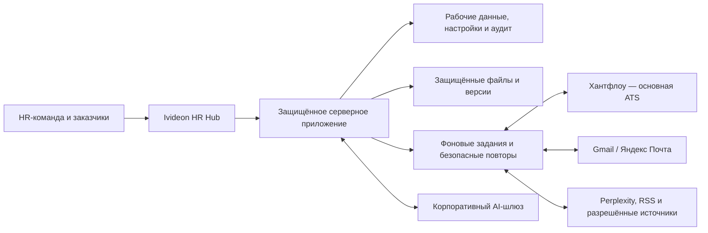

# Ivideon HR Hub

## Финальная продуктовая концепция для апрува

**Версия:** 1.1  
**Дата:** 4 августа 2026 года  
**Статус:** готово к продуктовому апруву  
**Основа:** Ivideon Recruit v7.4, changelog и QA-отчёт v7.4, регламент «Рекрутмент в Ivideon» и зафиксированные требования к развитию
**Целевая архитектура:** `Ivideon_HR_Hub_Final_Architecture_v1_0.md`

---

## 1. Решение в одном абзаце

**Ivideon HR Hub** — защищённая рабочая платформа и единая база знаний для HR-команды. Она связывает Хантфлоу, инструкции, AI-помощников и автоматизации в одном спокойном интерфейсе. Хантфлоу остаётся единственным рабочим местом для вакансий, кандидатов и воронки, а Ivideon HR Hub помогает выполнить конкретное действие: найти инструкцию, собрать документ или письмо, проанализировать интервью, подготовить поиск и вернуть подтверждённый результат в Хантфлоу.

## 2. Почему меняем текущий портал

Существующий standalone HTML уже содержит большую базу знаний, шаблоны, инструкции и полезные инструменты. Его нужно сохранить как содержательную основу, но он не может быть производственной интеграционной системой, потому что автономный браузерный файл не должен:

- хранить API-токены и почтовые доступы;
- постоянно синхронизироваться в фоне;
- безопасно работать с персональными данными;
- выполнять серверные автоматизации и повторять операции после сбоев;
- обеспечивать роли, аудит и управляемое хранение файлов;
- масштабироваться до полноценного HRM.

Поэтому проект является не косметическим обновлением HTML, а переходом от базы знаний к защищённой веб-платформе. Существующий портал используется как источник контента и прототип пользовательских сценариев. Раздел адаптации переносится без содержательной переработки.

## 3. Какую проблему решает продукт

Сейчас рекрутеру приходится одновременно:

- помнить регламент;
- искать нужную инструкцию;
- переносить данные между Хантфлоу, документами и почтой;
- вручную собирать оффер и письмо на согласование;
- следить за полнотой данных и SLA;
- самостоятельно формировать стратегию поиска;
- фиксировать результаты интервью;
- отслеживать изменения рынка и инструментов.

Из-за этого возникают повторные действия, ошибки в файлах и письмах, потеря контекста, разный уровень качества процессов и лишняя нагрузка на опытных сотрудников.

Ivideon HR Hub должен убирать необходимость **искать, копировать и помнить то, что система может безопасно найти, собрать, проверить и подготовить сама**.

## 4. Цели продукта

### Для рекрутера

- видеть текущие задачи и следующий шаг;
- выполнять типовой процесс с минимальным ручным копированием;
- получать инструкцию непосредственно в месте действия;
- быстро готовить оффер, письмо и запись в Хантфлоу;
- использовать AI как проверяемого помощника;
- работать в одном понятном интерфейсе.

### Для руководителя подбора и HRD

- получать единое качество данных и материалов;
- видеть сроки, узкие места и ошибки процесса;
- управлять пользователями, интеграциями, шаблонами, правилами и базой знаний;
- принимать и распределять новые заявки заказчиков;
- сокращать объём операционного контроля;
- сохранять прозрачную историю согласований.

### Для бизнеса

- ускорить подбор без снижения качества и контроля;
- уменьшить количество ошибок и повторной работы;
- быстрее вводить новых рекрутеров в процесс;
- получить расширяемую платформу вместо набора разрозненных инструментов.

## 5. Продуктовые принципы

1. **Хантфлоу остаётся основной ATS.** Портал не создаёт конкурирующую базу кандидатов.
2. **Действие и база знаний находятся рядом.** Пользователь не покидает задачу ради поиска регламента.
3. **Один экран — одна основная задача.** Дополнительные детали открываются по запросу.
4. **AI готовит, человек подтверждает.** AI не принимает решение о найме, не отказывает кандидату и не меняет этап скрыто.
5. **Никакого молчаливого изменения критических данных.** Суммы, даты, ФИО и юридические условия всегда подтверждаются.
6. **Автоматизация объяснима.** Пользователь видит, откуда взялось каждое поле и куда уйдёт результат.
7. **Безопасность проектируется сразу.** Доступы, аудит, хранение и удаление являются частью MVP.
8. **Сначала Ivideon, затем универсализация.** Первая версия решает реальный процесс компании; будущая HRM-модель закладывается архитектурно.

## 6. Пользователи и границы доступа

| Роль | Основные возможности |
|---|---|
| Рекрутер | Приоритеты поиска на неделю, создаваемые в портале офферы и письма, анализ интервью, база знаний, инструкции и автоматизации. Вакансии, кандидаты и воронка остаются только в Хантфлоу |
| Руководитель подбора | Работа команды, недельные приоритеты, заявки заказчиков, распределение заявок рекрутерам, SLA, согласования, качество материалов, шаблоны, эскалации и все права управления платформой |
| HRD | Финальные HR-согласования, заявки заказчиков, правила, аналитика, шаблоны и такие же права управления платформой, как у Руководителя подбора |
| Заказчик | Только собственные заявки и их статусы: отправлена, возвращена на доработку, принята в работу и назначена в подбор. Доступа к внутренней части портала, кандидатам и заявкам других заказчиков нет |

Отдельной роли администратора в первой версии нет: её функции выполняют Руководитель подбора и HRD. HRBP, Генеральный директор и КДП могут оставаться участниками отдельных бизнес-процессов и согласований, но собственные роли и личные кабинеты в портале им не создаются.

## 7. Единый рабочий маршрут рекрутера

На главной, в полном маршруте, поиске и инструкциях используется один порядок:

1. **Получена новая вакансия**
2. **Провожу бриф**
3. **Ищу кандидатов**
4. **Провожу HR-интервью**
5. **Показываю кандидата заказчику**
6. **Провожу совместное интервью с заказчиком**
7. **Согласовываю оффер**
8. **Делаю оффер кандидату**
9. **Готовлю выход сотрудника**
10. **Сопровождаю адаптацию**

Этап «Получена новая вакансия» начинается только после передачи поиска Руководителем подбора или HRD. Заявка заказчика не назначается рекрутеру автоматически и не создаёт обход централизованного распределения нагрузки.

Каждый этап имеет одинаковую обязательную структуру:

- **Вход в процесс** — какие условия должны быть выполнены;
- **Участники** — кто участвует и за что отвечает;
- **Что сделать** — рабочая последовательность и основное действие;
- **Как сделать** — пошаговая инструкция «что, где и как нажимать»;
- **SLA и эскалация** — когда должен быть результат и что делать при задержке;
- **Процесс завершён, когда** — проверяемый результат этапа.

Навигация назад работает по уровням: вложенный материал → родительская инструкция → этап → полный маршрут → главная. Введённые данные и позиция пользователя не теряются.

## 8. Целевая структура платформы

### 8.1. Моя работа

Главный экран зависит от роли.

**Рекрутер видит:**

- блок **«Фокусы недели»** с датами периода и поисками, которые Руководитель подбора поставил в приоритет; фокусы уточняются на командных точках контроля в понедельник и четверг;
- офферы, которые сейчас находятся на согласовании;
- незавершённые рабочие материалы — только созданные в портале офферы, анализы интервью и письма, которые пользователь начал готовить, но ещё не завершил или не передал дальше;
- быстрый переход в базу знаний и на нужный этап рабочего маршрута.

**Руководитель подбора и HRD видят:**

- новые заявки заказчиков;
- статус каждой заявки и действия «Принять в работу» или «Вернуть на доработку»;
- распределение принятых заявок между рекрутерами;
- фокусы команды на текущую неделю с датами;
- офферы на согласовании;
- функции управления платформой.

На главной нет списка вакансий, списка кандидатов, дублирующей воронки, общего блока просроченных SLA или технических ошибок синхронизации. Технические проблемы показываются только Руководителю подбора и HRD внутри раздела управления, если от них действительно требуется действие.

### 8.2. Работа с Хантфлоу без дублирования

- списки вакансий, кандидатов, этапы, история, комментарии и воронка остаются в Хантфлоу;
- портал не создаёт собственные карточки вакансий и кандидатов;
- из блока «Фокусы недели» и рабочих материалов пользователь переходит в оригинальную карточку Хантфлоу;
- при запуске автоматизации портал по ссылке или внешнему ID получает только необходимые для действия данные;
- внутри портала сохраняются только ссылка на объект Хантфлоу, созданные здесь материалы, статус операции и аудит;
- постоянное техническое соединение с API нужно для актуального получения и возврата данных, а не для создания второго интерфейса ATS.

### 8.3. Заявки от заказчиков

- генерация защищённой ссылки;
- мобильная форма без доступа к порталу;
- сохранение черновика;
- проверка обязательных данных;
- отправка новой заявки строго Руководителю подбора и HRD, но не рекрутерам;
- статусы «Отправлена», «Возвращена на доработку», «Принята в работу» и «Назначена рекрутеру»;
- возможность Руководителя подбора или HRD вернуть заявку заказчику с комментарием;
- назначение принятой заявки конкретному рекрутеру Руководителем подбора;
- преобразование согласованной заявки в вакансию или пакет для Хантфлоу;
- история изменений и отзыв доступа.

### 8.4. Центр офферов

- шаблоны и версии;
- заполнение из Хантфлоу;
- ручное заполнение;
- ввод всей информации одним сообщением;
- подтверждение распознанных полей;
- отдельная страница задач роли;
- предпросмотр и генерация PDF;
- маршрут согласования;
- сборка письма с вложениями;
- загрузка финального оффера в Хантфлоу.

### 8.5. Интервью и оценка

- подготовка к интервью;
- загрузка заметок или транскрипта;
- AI-анализ по критериям вакансии;
- разделение фактов, выводов, рисков и пробелов;
- доказательства для существенных выводов;
- редактируемый черновик комментария;
- подтверждаемая отправка результата в Хантфлоу.

### 8.6. AI-помощник по поиску

- карта поиска;
- целевые профили и синонимы должностей;
- must-have, nice-to-have и исключающие признаки;
- компании-доноры и смежные индустрии;
- стратегия каналов;
- запросы и фильтры для hh.ru;
- Boolean/X-Ray-варианты для других источников;
- гипотезы и порядок их проверки;
- шаблон первого сообщения;
- функция **«Подготовить запрос для AI»**: система составляет понятный текст, который можно скопировать в разрешённый компанией AI-сервис для разовой задачи, не покрытой готовым инструментом портала. Например: «Составь три варианта Boolean-запроса для поиска B2B Product Manager по этому профилю и объясни различия». Портал показывает, какой AI-сервис разрешено использовать и какие данные нельзя в него передавать. Если отдельный AI-чат компании не нужен, функция отключается.

### 8.7. База знаний рекрутера — основной раздел

- полный единый маршрут рекрутера;
- все инструкции «что, где и как нажимать»;
- все регламенты и правила работы;
- шаблоны, чек-листы, скрипты, примеры и памятки;
- встроенные помощники и рабочие инструменты;
- поиск по всей базе с исправлением опечаток и синонимами;
- переход из рабочего шага к нужному фрагменту инструкции и обратно;
- редактор, версии, владелец и дата проверки материалов.

В первой версии нет курсов, тестов, экзаменов и учёта учебного прогресса. Платформа помогает рекрутеру развиваться через полную, понятную и постоянно актуализируемую базу знаний непосредственно в работе.

### 8.8. HR-радар

- ежедневная лента HR- и recruitment-новостей;
- AI и HR Tech;
- рынок труда и исследования;
- практики компаний;
- инструменты и площадки;
- мероприятия и вебинары;
- «прочитать позже»;
- персональный еженедельный дайджест.

Основной способ обнаружения материалов — веб-поиск через Perplexity. Прямые RSS/API-подключения добавляются для источников, где важна гарантированная полнота. Закрытые сообщества подключаются только разрешённым способом.

### 8.9. Управление платформой

Раздел доступен только Руководителю подбора и HRD. Отдельной роли администратора нет.

- пользователи и роли;
- Хантфлоу и почтовые подключения;
- AI-провайдеры;
- справочники и поля;
- маршруты согласования;
- шаблоны офферов и писем;
- источники новостей;
- аудит;
- ошибки синхронизации и безопасные повторы.

## 9. Ключевой сценарий: согласование оффера

### Вход в процесс

Кандидат прошёл необходимые этапы оценки. Заказчик, рекрутер, HRBP, Руководитель подбора и другие участники оценки согласны, что кандидат подходит и компания готова сделать предложение.

### Участники согласования

- рекрутер;
- Руководитель подбора;
- HRBP;
- HRD / директор по персоналу;
- Генеральный директор;
- Кадры.

### Что делает рекрутер

1. Из карточки кандидата в Хантфлоу или по прямой ссылке запускает в портале действие «Собрать оффер».
2. Подтягивает данные из Хантфлоу или вставляет всю информацию одним сообщением.
3. Проверяет распознанные поля и подтверждает критические условия.
4. Добавляет задачи роли на отдельную страницу оффера.
5. Проверяет должность, подразделение, руководителя, компенсацию и формат работы.
6. Указывает новую ставку или замену и требуемое пояснение.
7. Проверяет этапы интервью и источник кандидата.
8. Формирует PDF и подтверждает финальную версию.
9. Получает очищенное CV с предпросмотром внесённых изменений.
10. Нажимает «Собрать письмо».

### Автоматически подготовленное письмо

Система формирует:

- фиксированных адресатов: **кому — Руководитель подбора и HRD; в копии — направление КДП: Алена Алешова и Мария Комиссарова**;
- тему письма по утверждённому шаблону;
- тело письма с данными кандидата и вакансии;
- новую ставку или замену;
- этапы интервью;
- источник кандидата;
- должность;
- подразделение;
- руководителя;
- компенсацию;
- формат работы;
- ссылку на профиль в Хантфлоу;
- очищенный PDF резюме;
- финальный PDF оффера.

Email-адреса будут добавлены после их предоставления. Рекрутер и AI не могут менять состав адресатов. Если корпоративная схема когда-либо изменится, изменить её смогут только Руководитель подбора или HRD в настройках управления.

Перед созданием черновика рекрутер видит контрольный экран и источник каждого значения. По умолчанию письмо не отправляется автоматически.

### Процесс завершён, когда

- условия подтверждены участниками маршрута;
- оффер согласован директором по персоналу;
- оффер согласован Генеральным директором;
- сохранён именно тот PDF, который согласовали. Если после согласования изменить сумму, должность, задачи или другой текст оффера, система пометит предыдущие согласования как относящиеся к старой версии и потребует согласовать обновлённый файл заново;
- оффер готов к презентации кандидату.

Если после согласования меняется существенное условие, создаётся новая версия и запускается повторное согласование.

## 10. Ключевой сценарий: делаю оффер кандидату

### Вход в процесс

Финальная версия оффера согласована, сохранена и готова к презентации.

### Участники

- рекрутер;
- кандидат;
- заказчик, Руководитель подбора или HRBP — при необходимости;
- Кадры — после принятия предложения.

### Рабочий сценарий

1. Система показывает установленный SLA и готовность материалов.
2. Рекрутер назначает звонок или встречу и презентует предложение лично, а не отправляет файл без контекста.
3. Объясняет роль, задачи, команду, условия, формат, сроки ответа и следующие шаги.
4. Проверяет понимание и задаёт вопросы:
   - что в предложении наиболее важно;
   - какие есть сомнения или недостающая информация;
   - участвует ли кандидат в других процессах;
   - ожидает ли контроффер;
   - что повлияет на финальное решение;
   - когда удобно вернуться с ответом.
5. Фиксирует вопросы и договорённости.
6. После презентации отправляет согласованный файл и письменное резюме условий.
7. Система создаёт задачу на контрольный контакт в установленный срок.

### Сомнения и контроффер

Помощник предлагает рекрутеру не готовое давление на кандидата, а структуру разговора:

- уточнить реальную причину сомнения;
- отделить вопрос от возражения;
- проверить приоритеты кандидата;
- ответить фактами без обещаний, которых нет в оффере;
- при изменении условий вернуть предложение на согласование;
- зафиксировать договорённость и следующий контакт.

### Отказ

При отказе система помогает:

- выбрать и уточнить корректную причину;
- сохранить уважительную коммуникацию;
- зафиксировать полезную обратную связь;
- записать итог в Хантфлоу после подтверждения;
- закрыть связанные задачи;
- сохранить возможность дальнейшего контакта только в рамках разрешённых правил.

### Процесс завершён, когда

- кандидат принял предложение и передан в подготовку выхода; либо
- отказ корректно зафиксирован, кандидат уведомлён и процесс закрыт;
- в Хантфлоу отражён итог и необходимые комментарии;
- все последующие задачи созданы или завершены.

Точные числовые SLA настраиваются по правилам компании и утверждаются на discovery, а не зашиваются в продукт без владельца.

## 11. Адаптивный генератор оффера

Пользователь может:

1. подтянуть данные из Хантфлоу;
2. заполнить форму;
3. вставить всю информацию подряд одним сообщением.

AI распознаёт ФИО, должность, подразделение, руководителя, оклад, gross/net, бонус, валюту, формат, город, график, дату выхода, срок ответа и задачи роли.

Правила надёжности:

- уверенные поля заполняются автоматически;
- спорные подсвечиваются;
- отсутствующие задаются короткими вопросами;
- система не придумывает условия;
- суммы, даты, ФИО и юридические формулировки подтверждаются человеком;
- перед выпуском выполняется орфографическая и смысловая проверка;
- значимые исправления показываются пользователю;
- оффер имеет версию, владельца, дату и историю изменений;
- предпросмотр совпадает с итоговым PDF;
- вторая страница содержит задачи и ожидаемые результаты роли.

## 12. Почта и документооборот

### Gmail

Подключение через корпоративный OAuth. Приоритетный сценарий — создание редактируемого черновика с темой, телом и вложениями. Отправка выполняется пользователем.

### Яндекс Почта

Подключение через разрешённый корпоративный OAuth-контур. Возможность создавать серверные черновики с вложениями проверяется отдельным пилотом. Если конкретный контур этого не позволяет, портал хранит безопасный черновик, показывает предпросмотр и выполняет отправку только после явного действия пользователя.

### Общие правила

- минимальные права доступа;
- токены не попадают в браузерный код;
- адресаты письма на согласование заранее зафиксированы: Руководитель подбора и HRD, в копии — Алена Алешова и Мария Комиссарова из направления КДП;
- рекрутер и AI не меняют адресатов; изменить корпоративную настройку могут только Руководитель подбора или HRD;
- перед действием видны получатели и вложения;
- факт создания, отправки или ошибки фиксируется;
- повторная операция не должна создавать дубликат письма или файла.

## 13. Постоянная синхронизация с Хантфлоу

### Источник истины

| Данные | Главная система |
|---|---|
| Вакансии, кандидаты, этапы и история рекрутмента | Хантфлоу |
| Финальный файл оффера в карточке кандидата | Хантфлоу, с версией и аудитом в портале |
| Инструкции, шаблоны, новости, база знаний и настройки автоматизаций | Ivideon HR Hub |
| Черновики и промежуточные AI-результаты | Ivideon HR Hub |

### Механика

1. Пользователь запускает действие из портала по ссылке или внешнему ID объекта Хантфлоу либо система получает разрешённое событие API.
2. Портал запрашивает из Хантфлоу только минимальный актуальный набор данных, необходимый для конкретной автоматизации.
3. Пользователь проверяет подготовленный результат.
4. После подтверждения портал возвращает разрешённый комментарий, статус или файл в оригинальную карточку Хантфлоу.
5. В портале сохраняются только внешний ID, технический статус операции, созданный здесь материал и аудит — не копия карточки кандидата или вакансии.
6. При сбое операция повторяется безопасно, а Руководитель подбора и HRD видят проблему в разделе управления.
7. Периодическая сверка проверяет незавершённые операции и подтверждает, что результат действительно появился в Хантфлоу.

Таким образом, соединение с Хантфлоу работает постоянно, но пользовательский интерфейс не дублирует ATS и не показывает второй список вакансий или кандидатов.

Точный список полей, файлов, вебхуков, write-back-операций и лимитов подтверждается в песочнице конкретного аккаунта до оценки сроков.

## 14. Интерфейс и пользовательский опыт

### Меньше визуального шума

- одна основная кнопка в смысловом блоке;
- сначала текущая задача, затем детали;
- длинные инструкции открываются пошагово;
- административные функции отделены от ежедневной работы;
- единые названия, статусы и расположение действий;
- быстрый интерфейс без скачков и лишних анимаций;
- полноценная работа с телефона там, где сценарий этого требует.

### Подсказки «?»

- на компьютере подсказка открывается при наведении;
- остаётся, пока курсор находится на значке;
- исчезает сразу после ухода курсора;
- работает при фокусе с клавиатуры;
- на мобильном открывается по нажатию;
- не перекрывает поле и учитывает границы экрана;
- объясняет термин или действие, но не прячет единственную критически важную информацию;
- редактируется через систему управления контентом.

### Понятные инструкции

Каждая инструкция содержит результат, роли, шаги, конкретные элементы интерфейса, пример, скриншот, ожидаемый итог, типовые ошибки, SLA, эскалацию и контрольный вопрос.

## 15. Единый поиск

Поиск охватывает разрешённые пользователю:

- вакансии и кандидатов;
- инструкции и статьи;
- шаблоны и скрипты;
- задачи и собственные черновики;
- новости;
- команды вроде «создать оффер».

Поиск:

- исправляет опечатки;
- понимает синонимы, например «оффер», «offer» и «предложение»;
- группирует результаты по типу;
- не показывает данные без права доступа;
- предлагает похожие запросы при нулевом результате;
- позволяет сообщить о неудачном поиске;
- сначала использует надёжный полнотекстовый механизм, а семантический слой добавляет после проверки качества и изоляции данных.

## 16. HR-радар через Perplexity

### Как работает

1. По расписанию запускаются поисковые запросы по согласованным темам.
2. Perplexity Search API возвращает найденные публичные материалы и ссылки.
3. Система проверяет источник, дату, язык и релевантность.
4. Дубликаты удаляются по ссылке и содержанию.
5. AI создаёт короткое резюме «что произошло» и «почему это важно HR».
6. Карточка сохраняет автора, дату, источник и оригинальную ссылку.
7. Спорные и рекламные материалы уходят на модерацию.
8. Из опубликованных карточек формируется персональный дайджест.

### Ограничения

- Perplexity не гарантирует доступ к закрытым Telegram-чатам, LinkedIn за авторизацией и платным материалам;
- веб-поиск может пропускать публикации или ошибаться в дате;
- портал не копирует статьи целиком без права;
- прямые RSS/API-подключения используются для критически важных источников;
- список доверенных и запрещённых источников управляется администратором.

## 17. Орфография и качество текста

- базовая проверка работает во всех свободных полях;
- очевидные опечатки исправляются с возможностью отмены;
- существенные переформулировки показываются как изменения;
- ФИО, бренды, суммы, даты и профессиональные термины не меняются молча;
- используется корпоративный словарь;
- письма, офферы и комментарии проходят финальную проверку перед выпуском.

## 18. Безопасная внешняя заявка

1. Руководитель подбора или HRD создаёт ссылку на форму заявки.
2. Система формирует ограниченный и отзываемый токен.
3. Заказчик открывает отдельную мобильную страницу без внутренней навигации.
4. Видит только свою форму, комментарий при возврате и статус заявки.
5. Сохраняет черновик и отправляет заполненную заявку.
6. Заявку получают только Руководитель подбора и HRD.
7. Они принимают её в работу либо возвращают заказчику на доработку с комментарием.
8. Руководитель подбора назначает принятую заявку конкретному рекрутеру.
9. Только после этого данные преобразуются в вакансию или передаются в Хантфлоу.

Ссылка имеет срок действия, не содержит открытых внутренних идентификаторов и не позволяет запросить другие заявки. Вложения проверяются, действия журналируются.

## 19. Безопасность и контроль AI

- корпоративный вход и MFA через принятый Identity Provider;
- роли и ограничения по объектам;
- шифрование трафика и хранения;
- секреты только в серверном защищённом хранилище;
- минимальные OAuth-права;
- аудит операций с кандидатами, письмами и файлами;
- политика хранения и удаления данных;
- резервное копирование и проверка восстановления;
- согласованный AI-провайдер;
- данные кандидатов не используются для обучения публичных моделей;
- резюме, транскрипты и внешние страницы считаются недоверенным входом;
- AI не исполняет найденные внутри документов инструкции;
- критические действия требуют подтверждения пользователя.

До пилота на реальных данных требуется согласование ИБ и юристов.

## 20. Целевая архитектура

Производственная версия состоит из интерфейса, серверного приложения, базы данных, файлового хранилища, фоновых заданий, интеграций, AI-шлюза и аудита.

На старте используется модульный монолит с отдельными фоновыми обработчиками. Микросервисы не вводятся без реальной необходимости.

## 21. Состав MVP

### Входит в первый производственный контур

- корпоративный вход, роли и аудит;
- базовая серверная платформа;
- read-sync Хантфлоу и критический write-back;
- единый маршрут из 10 этапов;
- спокойный адаптивный интерфейс;
- инструкции и единый компонент подсказки;
- поиск;
- центр офферов;
- ввод оффера одним текстом;
- отдельная страница задач роли;
- версии и PDF;
- очищенное CV;
- письмо на согласование с вложениями;
- одна полноценно подключённая почта;
- анализ интервью с подтверждаемой отправкой;
- безопасная заявка заказчика;
- управление ошибками и повторами для Руководителя подбора и HRD.

### Следующая продуктовая волна

- вторая почтовая интеграция;
- AI-помощник по поисковой стратегии;
- расширение и актуализация базы знаний;
- HR-радар через Perplexity;
- персональные дайджесты;
- расширенная аналитика процессов.

### Не входит в MVP

- замена Хантфлоу;
- автоматическое принятие решений о кандидатах;
- автоматическая отправка оффера без пользователя;
- универсальный сбор закрытого контента;
- payroll;
- КЭДО;
- отпуска и табель;
- compensation review;
- performance management;
- полный Core HR;
- универсальный HRM для внешних компаний.

## 22. Этапы реализации

### Этап 0. Discovery и технический пилот

- карта процессов и исключений;
- песочница Хантфлоу;
- карта полей и разрешённых операций;
- пилот CV → оффер → письмо → файл/комментарий обратно;
- проверка Gmail и/или Яндекса;
- проверка PDF на реальных обезличенных шаблонах;
- выбор AI-провайдера;
- матрица доступа;
- политика персональных данных;
- прототип ключевых экранов;
- метрики успеха.

**Результат:** подтверждённая реализуемость, границы интеграций, оценка сроков и план MVP.

### Этап 1. Платформенный фундамент

- вход и роли;
- сервер, данные, файлы и аудит;
- синхронизация чтения;
- рабочая очередь;
- маршрут, поиск, инструкции и подсказки.

### Этап 2. Критические автоматизации

- write-back;
- генератор оффера;
- версии и PDF;
- очищенное CV;
- письмо и приоритетная почта;
- анализ интервью;
- внешняя заявка.

### Этап 3. Помощники, база знаний и HR-радар

- стратегия поиска;
- расширение базы знаний и контекстных подсказок;
- Perplexity-поиск новостей;
- персональные дайджесты;
- аналитика качества и использования.

### Этап 4. Расширение в HRM

- Core HR;
- адаптация как операционный модуль;
- HR Service Desk;
- performance;
- engagement;
- compensation;
- документы, отсутствия и аналитика через отдельные проекты и интеграции.

## 23. Критерии успеха

Точные базовые значения измеряются на discovery. После этого утверждаются целевые изменения.

### Операционные метрики

- время от финального решения до готового черновика письма;
- доля офферов, собранных без ручного копирования;
- количество исправлений в офферах и вложениях;
- время на фиксацию анализа интервью;
- доля действий, корректно вернувшихся в Хантфлоу;
- просроченные SLA;
- число ошибок синхронизации и время их устранения.

### Пользовательские метрики

- доля рекрутеров, использующих портал еженедельно;
- успешность ключевых сценариев без помощи;
- время поиска инструкции или функции;
- оценка понятности интерфейса;
- использование контекстных подсказок;
- процент неудачных поисковых запросов.

### Качественные ограничения

- AI не придумывает критические условия оффера;
- существенные выводы анализа имеют доказательства;
- пользователь видит адресатов, файлы и целевую карточку до отправки;
- повторное событие не создаёт дубль;
- ошибка не отображается как успешная операция;
- права доступа проверяются до выдачи данных.

## 24. Известные сложности и способ их контроля

| Сложность | Как контролируем |
|---|---|
| Неизвестные ограничения Хантфлоу | Песочница и технический пилот до обещания сроков |
| Конфликты синхронизации | Версии, идемпотентность, сверка и очередь ошибок |
| Чувствительные кандидатские данные | ИБ/юридическое согласование, AI-шлюз, минимизация и аудит |
| Ошибки AI в оффере | Уверенность по полям и обязательное подтверждение критических значений |
| Переполнение PDF | Реальные шаблоны, предпросмотр и правила адаптации макета |
| Различия Gmail и Яндекса | Сначала один подтверждённый контур, затем второй адаптер |
| Предвзятость анализа интервью | Факты и доказательства, редактирование, запрет автономных решений |
| Исключения процессов | Настраиваемые маршруты, справочники и матрица согласований |
| Утечка через поиск или роли | Проверка прав при индексации и при выдаче, тесты изоляции |
| Небезопасная внешняя ссылка | Ограниченный токен, срок, отзыв, изолированная форма и журнал |
| Шум и дубли в новостях | Доверенные источники, дедупликация, модерация и оригинальные ссылки |
| Устаревшие инструкции | Владелец, версия, дата проверки и обратная связь пользователя |
| Разрастание до полного HRM | Жёсткая граница MVP и отдельный roadmap расширения |

## 25. Что требуется до начала разработки MVP

- тестовый доступ или песочница Хантфлоу;
- перечень API-прав;
- обезличенные примеры кандидатов, вакансий, комментариев и файлов;
- актуальные шаблоны офферов;
- правила очистки CV;
- матрица согласования офферов и исключения;
- выбор первой почты: Gmail или Яндекс;
- корпоративный SSO;
- политика хранения и удаления персональных данных;
- решение по AI-провайдеру;
- числовые SLA;
- список пилотных пользователей;
- список новостных тем и доверенных источников;
- владелец продукта со стороны HR;
- владелец интеграций со стороны IT.

## 26. Предмет продуктового апрува

Предлагается утвердить:

1. видение Ivideon HR Hub как рабочего слоя и единой базы знаний поверх Хантфлоу без дублирования вакансий и кандидатов;
2. единый маршрут из 10 этапов;
3. состав продуктовых модулей;
4. принцип human-in-the-loop для AI и значимых действий;
5. границы первого производственного контура;
6. поэтапное подключение почты;
7. Perplexity как основу поиска для HR-радара;
8. обязательность безопасности, ролей и аудита в MVP;
9. технический пилот до фиксации сроков и бюджета;
10. развитие в полный HRM как отдельную последующую программу.

Апрув этой концепции **не является** утверждением точных сроков, бюджета, дизайна каждого экрана или неподтверждённых возможностей внешних API. Эти параметры формируются после discovery и технического пилота.

## 27. Итоговая формулировка

**Ivideon HR Hub должен стать единым спокойным пространством, в котором HR понимает следующий шаг, получает помощь прямо в контексте работы и выполняет рутинные операции с минимальным количеством действий. Платформа не заменяет и не дублирует Хантфлоу, сохраняет контроль человека, снижает количество ошибок, делает все инструкции и инструменты доступными в одном месте и создаёт техническую основу для дальнейшего развития в полноценный HRM.**

---

## Приложение. Что потребуется изменить относительно Ivideon Recruit v7.4

- поменять местами этапы 5 и 6 в едином массиве маршрута: сначала показ кандидата заказчику, затем совместное интервью;
- синхронно обновить порядок на главной, в полном маршруте, changelog и QA-проверках;
- заменить прежнюю схему адресатов офферного письма на фиксированную: Руководитель подбора и HRD, в копии — Алена Алешова и Мария Комиссарова;
- реализовать разные главные экраны для рекрутера, Руководителя подбора/HRD и заказчика;
- не добавлять в портал отдельные списки вакансий, кандидатов или копию воронки Хантфлоу;
- сделать базу знаний центральным разделом и не добавлять курсы, тесты и учебный прогресс;
- перенести существующее содержание адаптации без смысловой переработки;
- сохранить подтверждённые v7.4 требования к структуре этапов, иерархической навигации назад и уникальности материалов.

## Приложение. Основные внешние зависимости

- [Huntflow API](https://huntflow.ai/api)
- [Gmail API](https://developers.google.com/workspace/gmail/api/reference/rest)
- [Яндекс Почта: OAuth](https://yandex.ru/support/yandex-360/business/mail/ru/web/security/oauth)
- [Perplexity Search API](https://docs.perplexity.ai/docs/search/quickstart)
- [Perplexity Sonar API](https://docs.perplexity.ai/docs/sonar/quickstart)
- [API hh.ru](https://hh.ru/article/31102)
